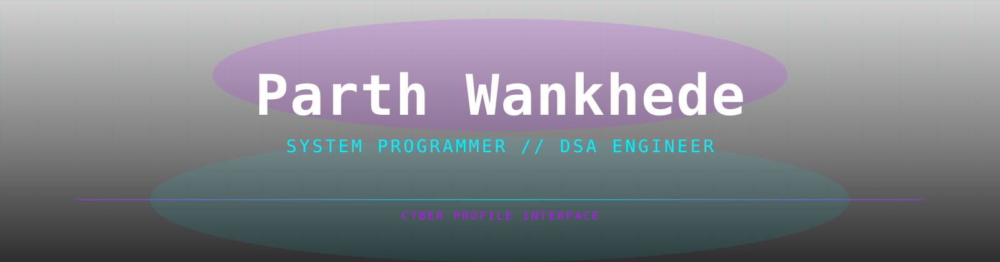

<div align="center">




</div>

---

<div align="center">

[](https://linkedin.com/in/parth-wankhede)
[](mailto:parth.wankhade@gmail.com)
[](https://twitter.com/Parth-Wankhade)
[](https://discord.com/users/Parth-Wankhade)

</div>

## `> whoami`

<table>
<tr>
<td width="55%" valign="top">

```bash
$ cat /etc/parth.conf

[identity]
name        = Parth Wankhede
role        = System Programmer / DSA Engineer
location    = India 🇮🇳
status      = Currently hacking the mainframe...

[traits]
ambition    = MAXIMUM
curiosity   = OVERFLOWING
patience    = segfault pending
coffee      = non-negotiable dependency

[mission]
primary     = Write code so fast it breaks time
secondary   = Make malloc() return happiness
tertiary    = World domination via C pointers

[warning]
> Do NOT ask me why I use Vim.
> I will explain for 3 hours.
```

</td>

</tr>
</table>

---

## `> ./skills --list`

<div align="center">


</div>

---

### `// Languages`


### `// System & DSA`


### `// Tools`


### `// DevOps & Environment`


---

## `> sudo stats --verbose`

<div align="center">

<a href="https://github.com/Parth-Wankhade">
  
  
</a>

<br/>


</div>

---

## `> ./activity --graph --neon`

<div align="center">

[](https://github.com/Parth-Wankhade)

> `// pulsing neon waveform – your commit heartbeat`


</div>

---

## `> git log --trophies`

<div align="center">

[](https://github.com/Parth-Wankhade)

</div>

---

## `> cat current_quest.txt`

```c
struct Quest current_quests[] = {
    {
        .id     = 0x01,
        .title  = "Custom Memory Allocator",
        .desc   = "Building malloc/free from scratch in C — because why not own the heap",
        .status = IN_PROGRESS,
    },
    {
        .id     = 0x02,
        .title  = "Linux Kernel Modules",
        .desc   = "Writing loadable kernel modules — talking directly to the OS gods",
        .status = IN_PROGRESS,
    },
    {
        .id     = 0x03,
        .title  = "DSA Grind",
        .desc   = "Solving 500+ problems — trees, graphs, DP — until they fear me",
        .status = ONGOING,
    },
    {
        .id     = 0x04,
        .title  = "Open Source Contribution",
        .desc   = "Finding a worthy C/systems project and leaving my mark on the codebase",
        .status = SCOUTING,
    },
};
```

---

## `> cat /dev/random | grep weird`

<table>
<tr>
<td width="50%" valign="top">

**🐛 Bug of the Week:**
```
TypeError: life is not defined
  at monday.js:1:1
  at undefined (existence.c)
  → coffee required to resolve
```

**☕ Current Coffee Intake:**
```
[██████████████████░░] 90% — dangerous zone
```

**💀 Favorite Error:**
```bash
$ ./my_program
Segmentation fault (core dumped)
# ah yes, an old friend
```

</td>
<td width="50%" valign="top">

**😂 Programmer Joke:**
> Why do C programmers make great poets?
> Because they can write in **verse** without any **garbage collection**.

**🧠 Fun Fact:**
> I debug with `printf()` not because I'm lazy —
> but because GDB and I have **trust issues**.

**🔢 My Favourite Number:**
> `0xDEADBEEF` — it just *speaks* to me.

</td>
</tr>
</table>

---

## `> curl -L totally-safe-link.com`

<div align="center">

[](https://www.youtube.com/watch?v=dQw4w9WgXcQ)

> `⚠ WARNING: Clicking this badge may cause irreversible ear-worms and existential joy`

</div>

---

## `> fortune | cowsay`

<div align="center">

[](https://github.com/piyushsuthar/github-readme-quotes)

</div>

---

<div align="center">

**Made with ☕, ⚡, and too many late nights**

*If this profile impressed you, drop a ⭐ — it compiles faster with stars.*

```c
void* happiness = malloc(sizeof(happiness));
// returns NULL sometimes
// that's okay — we debug and keep going
```


`// EOF — thanks for reading the source code of my existence`

</div>
